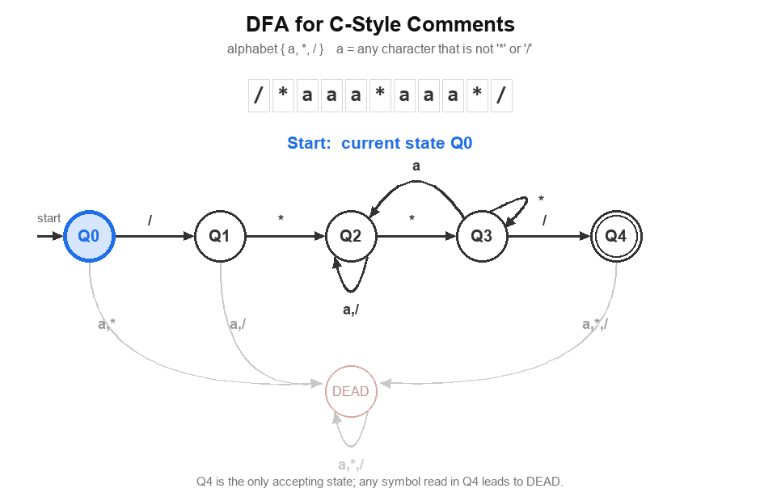
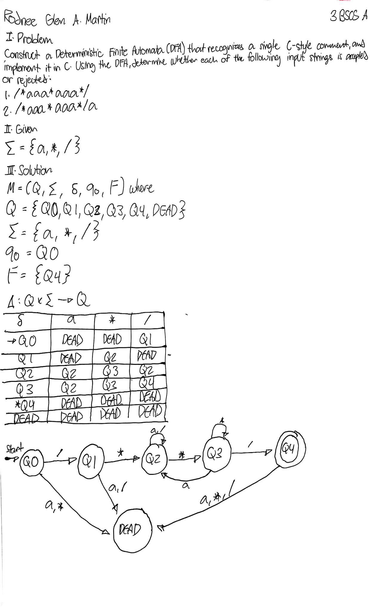

# DFA for C-Style Comments

**Rodnee Glen A. Martin**  
**3 BSCS-A**  
**CS 13a — Automata Theory and Formal Language**

A C implementation of a Deterministic Finite Automaton (DFA) that recognizes C-style comments. The DFA uses the abstract alphabet `{a, *, /}`, where `a` represents any character other than `*` or `/`.

## DFA Visualization



## States

| State | Meaning |
| --- | --- |
| `Q0` | start state |
| `Q1` | opening `/` has been read |
| `Q2` | inside the comment |
| `Q3` | `*` has been encountered inside the comment |
| `Q4` | accepting state after the closing delimiter |
| `DEAD` | trap / reject state |

## Formal Definition

```
M = (Q, Σ, δ, q₀, F)

Q  = { Q0, Q1, Q2, Q3, Q4, DEAD }
Σ  = { a, *, / }
q₀ = Q0
F  = { Q4 }
```

## Transition Table

| `δ` | `a` | `*` | `/` |
| --- | :-: | :-: | :-: |
| → `Q0` | `DEAD` | `DEAD` | `Q1` |
| `Q1` | `DEAD` | `Q2` | `DEAD` |
| `Q2` | `Q2` | `Q3` | `Q2` |
| `Q3` | `Q2` | `Q3` | `Q4` |
| \* `Q4` | `DEAD` | `DEAD` | `DEAD` |
| `DEAD` | `DEAD` | `DEAD` | `DEAD` |

`→` marks the start state and `*` marks the accepting state. Every state has exactly one transition for each symbol, so `δ` is a total function and the DFA is complete.

## Compile

```bash
gcc -Wall -Wextra -std=c11 comment.c -o comment
```

## Run

Windows:

```bash
.\comment.exe
```

Linux / macOS:

```bash
./comment
```

## Example

Both demonstrations are hardcoded in `comment.c`:

```c
const char *comments[] = {
    "/*aaa*aaa*/",
    "/*aaa*aaa*/a"
};
```

The second comment reaches `Q4` on the closing `*/`, but the extra `a` afterwards moves the DFA from `Q4` to `DEAD`.

Output:

```
/*aaa*aaa*/
Accepted

/*aaa*aaa*/a
Rejected
```

## Handwritten Solution

<a href="Handwritten.pdf"></a>

[`Handwritten.pdf`](Handwritten.pdf) holds the full-resolution page: the problem statement, the alphabet, the formal definition, the transition table, and the state transition diagram.
